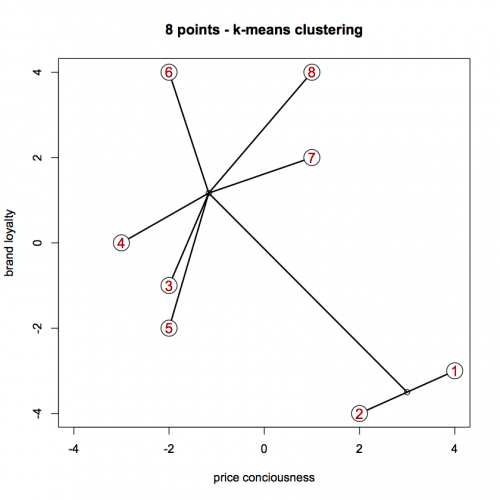

[](http://quantlet.de/)

## [](http://quantlet.de/) **SMSclus8km** [](http://quantlet.de/)

```yaml

Name of Quantlet : SMSclus8km

Published in : 'Multivariate Statistics: Exercises and Solutions'

Description : 'performs a k-means cluster analysis with the standard algorithm (Lloyds) on an 8
points example'

Keywords : cluster-analysis, plot, graphical representation, distance, partitioning

See also : 'MVAclususcrime, MVAdrugsim, SMSclus8p, SMSclus8p, SMSclus8pd, SMSclus8pd,
SMSclus8pmst2, SMSclusbank, SMSclusbank2, SMSclusbank3, SMScluscomp, SMScluscrime,
SMScluscrimechi2, SMSclushealth'

Author : Simon Trimborn, Elisabeth Bommes

Submitted : Fri, August 22 2014 by Awdesch Melzer

Example : 8 point example for k-means algorithm

```




### R Code:
```r
graphics.off()
rm(list=ls(all=T))
set.seed(100)
eight   = cbind(c(-3,-2,-2,-2,1,1,2,4), c(0,4,-1,-2,4,2,-4,-3))
eight   = eight[c(8,7,3,1,4,2,6,5),]
results = kmeans(eight,2, algorithm="Lloyd")


plot(eight,type="n", xlab="price conciousness",ylab="brand loyalty",main="8 points - k-means clustering", xlim=c(-4,4))
points(results$centers[1,1],results$centers[1,2], col = "black")
points(results$centers[2,1],results$centers[2,2], col = "black")

# Plot Lines
results$cluster
for (i in 1:8){
  segments(eight[i,1], eight[i,2],
           results$centers[results$cluster[i], 1],results$centers[results$cluster[i], 2],lwd=2)
}

segments(results$centers[1,1],results$centers[1,2],results$centers[2,1],results$centers[2,2],lwd=2)

points(eight, pch=21, cex=3, bg="white")
text(eight, as.character(1:8),col="red3",cex=1.2)


```
