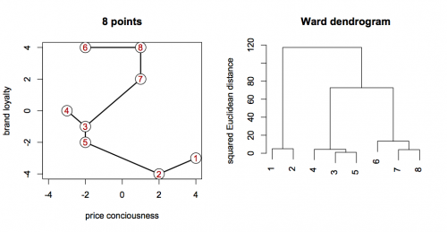
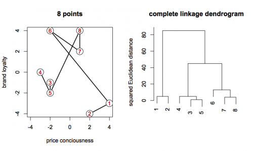

[](http://quantlet.de/)

## [](http://quantlet.de/) **SMSclus8p** [](http://quantlet.de/)

```yaml

Name of Quantlet : SMSclus8p

Published in : 'Multivariate Statistics: Exercises and Solutions'

Description : 'employs the Ward method and complete linkage using squared Euclidean distance
matrices to perform a cluster analysis on an 8 points example'

Keywords : cluster-analysis, dendrogram, Ward algorithm, linkage, euclidean, distance

See also : 'MVAQnetClusKmeans, MVAQnetClusKmeansB, MVAQnetClusKmeansT, MVAcarsim, MVAclus8p,
MVAclusfood, MVAclususcrime, MVAdrugsim, MVAspecclust, SMScarsim, SMSclus8km, SMSclus8pa,
SMSclus8pc, SMSclus8pd, SMSclus8pmst, SMSclus8pmst2, SMSclus8psc, SMSclusbank, SMSclusbank2,
SMSclusbank3, SMScluscereal, SMScluscomp, SMScluscrime, SMScluscrimechi2, SMSclushealth,
SMSclushealth05, SMScluskmcereal, SMScluskmhealth'

Author : Awdesch Melzer

Submitted : Fri, August 22 2014 by Awdesch Melzer

Example : 'Complete linkage using squared Euclidean distance for 8 points example, Ward method
using squared Euclidean distance for 8 points example'

```






### R Code:
```r
# clear cache and close windows
graphics.off()
rm(list = ls(all = TRUE))

# define eight points
eight = cbind(c(-3, -2, -2, -2, 1, 1, 2, 4), c(0, 4, -1, -2, 4, 2, -4, -3))
eight = eight[c(8, 7, 3, 1, 4, 2, 6, 5), ]

# plot eight points using ward algorithm
par(mfrow  =  c(1,  2))
plot(eight, type = "n", xlab = "price conciousness", ylab = "brand loyalty", 
	 xlim = c(-4, 4), main = "8 points")
segments(eight[1, 1], eight[1, 2 ], eight[2, 1 ], eight[2, 2], lwd = 2)
segments(eight[2, 1], eight[2, 2 ], eight[5, 1 ], eight[5, 2], lwd = 2)
segments(eight[5, 1], eight[5, 2 ], eight[3, 1 ], eight[3, 2], lwd = 2)
segments(eight[3, 1], eight[3, 2 ], eight[4, 1 ], eight[4, 2], lwd = 2)
segments(eight[3, 1], eight[3, 2 ], eight[7, 1 ], eight[7, 2], lwd = 2)
segments(eight[7, 1], eight[7, 2 ], eight[8, 1 ], eight[8, 2], lwd = 2)
segments(eight[8, 1], eight[8, 2 ], eight[6, 1 ], eight[6, 2], lwd = 2)

points(eight,  pch = 21,  cex = 2.7,  bg = "white")
text(eight, as.character(1:8), col = "red3", xlab = "first coordinate",  
	 ylab = "second coordinate", main = "8 points", cex = 1)

plot(hclust(dist(eight, method = "euclidean")^2, method = "ward"), 
	 ylab = "squared Euclidean distance", xlab = "", sub = "", main = "Ward dendrogram") 


dev.new()
# plot eight points using complete linkage
par(mfrow  =  c(1,  2))
plot(eight, type = "n", xlab = "price conciousness", ylab = "brand loyalty", 
	 xlim = c(-4, 4), main = "8 points")
segments(eight[1, 1], eight[1, 2 ], eight[2, 1 ], eight[2, 2], lwd = 2)
segments(eight[1, 1], eight[1, 2 ], eight[6, 1 ], eight[6, 2], lwd = 2)
segments(eight[6, 1], eight[6, 2 ], eight[7, 1 ], eight[7, 2], lwd = 2)
segments(eight[7, 1], eight[7, 2 ], eight[8, 1 ], eight[8, 2], lwd = 2)
segments(eight[8, 1], eight[8, 2 ], eight[5, 1 ], eight[5, 2], lwd = 2)
segments(eight[5, 1], eight[5, 2 ], eight[4, 1 ], eight[4, 2], lwd = 2)
segments(eight[5, 1], eight[5, 2 ], eight[3, 1 ], eight[3, 2], lwd = 2)
points(eight,  pch = 21,  cex = 2.7,  bg = "white")
text(eight, as.character(1:8), col = "red3", xlab = "first coordinate", 
	 ylab = "second coordinate", main = "8 points", cex = 1)

plot(hclust(dist(eight, method = "euclidean")^2, method = "complete"),
     ylab = "squared Euclidean distance", xlab = "", sub = "", 
     main = "complete linkage dendrogram") 

```
