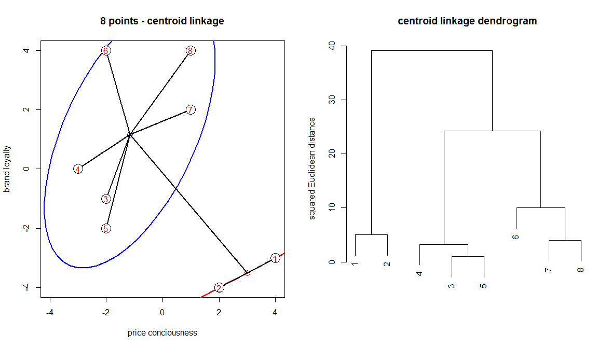

[](http://quantlet.de/index.php?p=info)

## [](http://quantlet.de/) **SMSclus8pc** [](http://quantlet.de/d3/ia)

```yaml

Name of Quantlet : SMSclus8pc

Published in : 'Multivariate Statistics: Exercises and Solutions'

Description : 'Employs the centroid linkage using squared Euclidean distance matrices to perform a
cluster analysis on an 8 points example'

Keywords : cluster-analysis, dendrogram, euclidean, distance, linkage

See also : 'MVAclususcrime, MVAdrugsim, SMSclus8p, SMSclus8pd, SMSclus8pd, SMSclus8pmst2,
SMSclusbank, SMSclusbank2, SMSclusbank3, SMScluscomp, SMScluscrime, SMScluscrimechi2,
SMSclushealth'

Author : Awdesch Melzer

Submitted : Fri, August 22 2014 by Awdesch Melzer

Example : 8 points example for centroid algorithm

```




### R Code:
```r
# clear cache and close windows
graphics.off()
rm(list=ls(all=TRUE))

# install.packages("car")
library(car)

# define eight points
eight  = cbind(c(-3,-2,-2,-2,1,1,2,4),c(0,4,-1,-2,4,2,-4,-3))
eight  = eight[c(8,7,3,1,4,2,6,5),]
w      = hclust(dist(eight,method="euclidean")^2,method="centroid")
groups = cutree(w, k=2)
merg   = cbind(eight, as.matrix(groups))
merg   = merg[sort.list(merg[,3]),]
merg1  = merg[which(merg[,3]==1),1:2]
merg2  = merg[which(merg[,3]==2),1:2]
m1     = apply(merg1,2,mean)
m2     = apply(merg2,2,mean)


dev.new()
# plot eight points using centroid linkage
par(mfrow = c(1, 2))
plot(eight,type="n", xlab="price conciousness",ylab="brand loyalty",main="8 points - centroid linkage", xlim=c(-4,4))

dataEllipse(x = c(merg1[,1]), y = c(merg1[,2]), center.pch = 1, col = "red", 
            plot.points = F, add = T,levels = 0.7)
dataEllipse(x = merg2[,1], y = merg2[,2], center.pch = 1, col = "blue", 
            plot.points = F, add = T,levels = 0.7)

segments(m2[1],m2[2],eight[3,1],eight[3,2],lwd=2)
segments(m2[1],m2[2],eight[4,1],eight[4,2],lwd=2)
segments(m2[1],m2[2],eight[5,1],eight[5,2],lwd=2)
segments(m2[1],m2[2],eight[6,1],eight[6,2],lwd=2)
segments(m2[1],m2[2],eight[7,1],eight[7,2],lwd=2)
segments(m2[1],m2[2],eight[8,1],eight[8,2],lwd=2)

segments(m1[1],m1[2],eight[1,1],eight[1,2],lwd=2)
segments(m1[1],m1[2],eight[2,1],eight[2,2],lwd=2)

segments(m1[1],m1[2],m2[1],m2[2],lwd=2)
points(eight, pch=21, cex=2.6, bg="white")
text(eight,as.character(1:8),col="red3",cex=1)

plot(hclust(dist(eight,method="euclidean")^2,method="centroid"),ylab="squared Euclidean distance",sub="",xlab="",main="centroid linkage dendrogram") 


```
