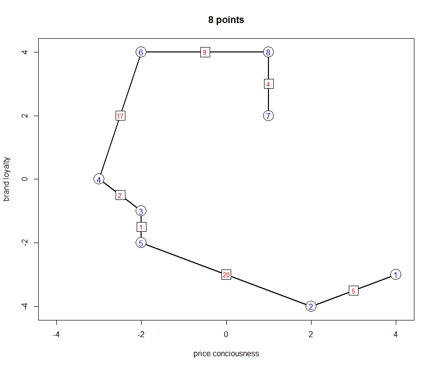

[](http://quantlet.de/)

## [](http://quantlet.de/) **SMSclus8pmst2** [](http://quantlet.de/)

```yaml

Name of Quantlet : SMSclus8pmst2

Published in : 'Multivariate Statistics: Exercises and Solutions'

Description : Plots an 8 points example for minimum spanning trees (MST)

Keywords : cluster-analysis, plot, graphical representation, distance, euclidean

See also : 'MVAQnetClusKmeans, MVAQnetClusKmeansB, MVAQnetClusKmeansT, MVAcarsim, MVAclus8p,
MVAclusbank, MVAclusbh, MVAclusfood, MVAspecclust, SMScarsim, SMSclus8km, SMSclus8p, SMSclus8pa,
SMSclus8pc, SMSclus8pd, SMSclus8pmst, SMSclusbank, SMSclusbank2, SMSclusbank3, SMScluscereal,
SMScluscomp, SMScluscrime, SMScluscrimechi2, SMSclushealth05, SMScluskmcereal, SMScluskmhealth'

Author : Elisabeth Bommes, Simon Trimborn, Awdesch Melzer

Submitted : Wed, October 01 2014 by Awdesch Melzer

```




### R Code:
```r
# clear cache and close windows
graphics.off()
rm(list=ls(all=TRUE))

# define eight points, compute distance matrix
eight        = cbind(c(-3,-2,-2,-2,1,1,2,4),c(0,4,-1,-2,4,2,-4,-3))
eight        = eight[c(8,7,3,1,4,2,6,5),]
dist_eight   = (as.matrix(dist(eight, method = "euclidian")))^2
comb = c(1,2,5,3,4,6,8,7)

dev.new()
# plot eight points using average linkage
par(mfrow = c(1, 1),cex=1)

plot(eight, pch=16, xlab="price conciousness",ylab="brand loyalty",main="8 points",
     xlim=c(-4.1,4.1),ylim=c(-4.1,4.1))

# Plot Lines
for (i in 2:length(comb)) {
  segments(eight[comb[i-1],1],eight[comb[i-1],2 ],eight[comb[i],1 ],eight[comb[i],2],lwd=2,"black")
}

# Plot Distances
for (j in 2:8) {
  points((eight[comb[j-1],1]+eight[comb[j],1])/2, (eight[comb[j-1],2]+eight[comb[j],2])/2, pch=22, cex=3, bg="white")
  text((eight[comb[j-1],1]+eight[comb[j],1])/2, (eight[comb[j-1],2]+eight[comb[j],2])/2 ,
       dist_eight[comb[j-1],comb[j]],col="red3", cex = 0.8)
}

# Plot Nodes
points(eight, pch=21, cex=3, bg="white")
text(eight[,1],eight[,2],as.character(1:8),col="blue3",cex=1)

```
