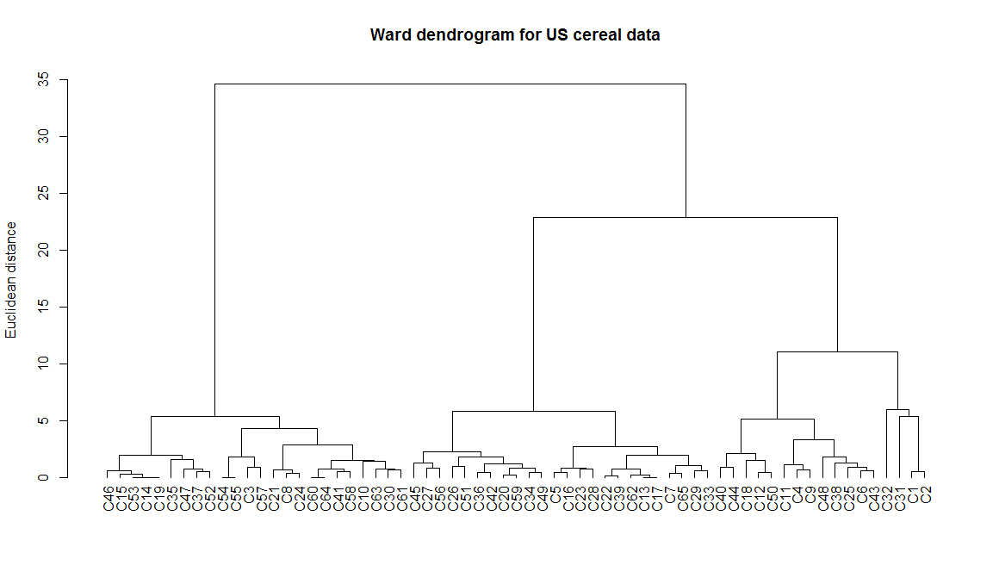
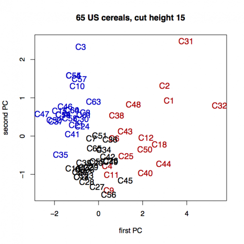

[](http://quantlet.de/)

## [](http://quantlet.de/) **SMScluscereal** [](http://quantlet.de/)

```yaml

Name of Quantlet : SMScluscereal

Published in : 'Multivariate Statistics: Exercises and Solutions'

Description : 'Performs a cluster analysis for the US cereal data from the R-package MASS. On the
transformed data will be performed a principal component analysis and a cluster analysis employing
Euclidean distance with the Ward linkage algorithm. Plots of principal components and the
dendrogram are presented. After extraction of 3 clusters, the principal components with the 3
clusters (denoted by different colours) are shown'

Keywords : 'cluster-analysis, dendrogram, pca, principal-components, plot, graphical
representation, Ward algorithm, euclidean, distance'

See also : 'MVAclus8p, MVAclusbank, MVAclusbh, MVAclusfood, MVAclususcrime, MVAdrugsim, SMSclus8p,
SMSclus8pd, SMSclus8pmst2, SMSclusbank, SMSclusbank2, SMSclusbank3, SMScluscomp, SMScluscrime,
SMScluscrimechi2, SMSclushealth, SMScluskmcereal'

Author : Simon Trimborn, Awdesch Melzer

Submitted : Fri, August 22 2014 by Awdesch Melzer

Example : principal components of the clusters, ward dendrogram

```






### R Code:
```r
# clear variables and close windows
rm(list=ls(all=TRUE))
graphics.off()

#install.packages("MASS")
library(MASS)

cereal = matrix(c(UScereal$calories, UScereal$protein ,UScereal$fat,
           UScereal$sugars), nrow = length(UScereal$calories), ncol = 4)
rownames(cereal) = paste("C",1:65, sep="")
colnames(cereal) = c("calories", "protein", "fat", "sugars")

sc_cereal = scale(cereal)
D         = dist(sc_cereal, method="euclidean")
hc        = hclust(D,"ward")

plot(as.dendrogram(hc),xlab="",sub="",ylab="Euclidean distance",
     main = "Ward dendrogram for US cereal data")

pr             = prcomp(sc_cereal)
prx            = t(t(pr$x[,1:2])*(sign(pr$x[1,1:2])))
cut            = cutree(hc, h = 15)
merg           = matrix(c(prx, as.matrix(cut)), nrow = 65, ncol = 3)
rownames(merg) = rownames(prx)
merg           = merg[sort.list(merg[,3]),]
merg1          = merg[1:17,1:2]
merg2          = merg[18:41,1:2]
merg3          = merg[42:65,1:2]

dev.new()
plot(prx,type="n",xlab="first PC",ylab="second PC", 
     main="65 US cereals, cut height 15")
text(merg1[,1],merg1[,2],rownames(merg1),cex=1.2, col="red3")
text(merg2[,1],merg2[,2],rownames(merg2),cex=1.2, col="blue3")
text(merg3[,1],merg3[,2],rownames(merg3),cex=1.2, col="black")

```
