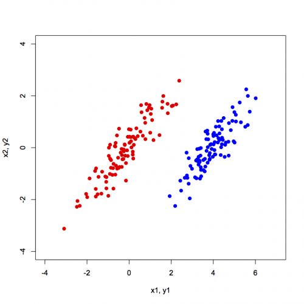

[](http://quantlet.de/index.php?p=info)

## [](http://quantlet.de/) **SMSmdmv** [](http://quantlet.de/d3/ia)

```yaml

Name of Quantlet : SMSmdmv

Published in : 'Multivariate Statistics: Exercises and Solutions'

Description : 'Computes and plots the values for two bivariate normally distributed random
variables with a specified mean and covariance matrix.'

Keywords : bivariate, multivariate, multivariate normal, normal, plot, graphical representation

Author : Simon Trimborn

Submitted : Fri, August 22 2014 by Awdesch Melzer

Input : 'n- number of observations, rho- correlation, mean_x- mean of x vector, mean_y- mean of y
vector'

Output : Plot for the values of two bivariate normally distributed random variables

Example : 'Default settings: Plot for the mean_x = c(0,0), mean_y = c(4,0), standard variance and
rho = 0.9'

```




### R Code:
```r
rm(list=ls())
graphics.off()
# install.packages("mvtnorm")
library(mvtnorm)
n      = 100
rho    = 0.9
mean_x = c(0,0)
mean_y = c(4,0)

sigma  = matrix(c(1,rho,rho,1), nrow = 2, ncol = 2)
x      = rmvnorm(n=n, mean = mean_x, sigma = sigma)
y      = rmvnorm(n=n, mean = mean_y, sigma = sigma)
xy     = rbind(x,y) # defined for computing xlim and ylim

plot(x, col='red', pch = 19, ylim = c(round(min(xy[,2]))-1,round(max(xy[,2]))+1),
     xlim = c(round(min(xy[,1]))-1,round(max(xy[,1]))+1),
     xlab = 'x1, y1', ylab = 'x2, y2')
points(y,col = 'blue', pch = 19)

```
